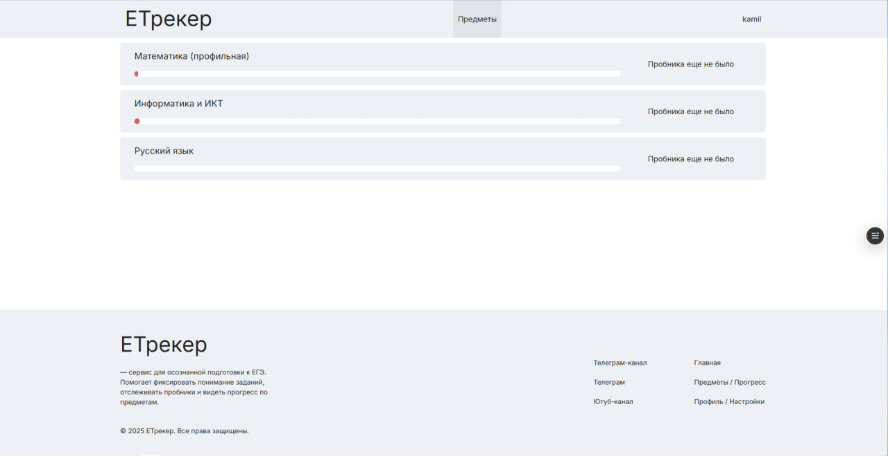
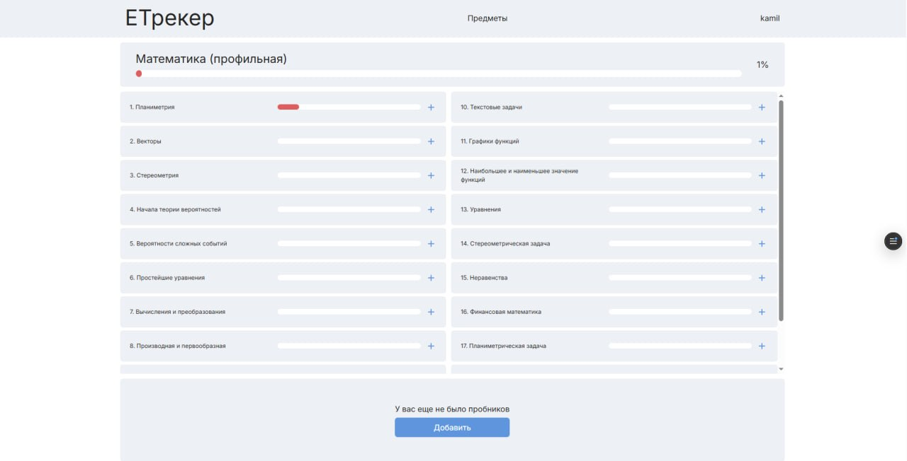
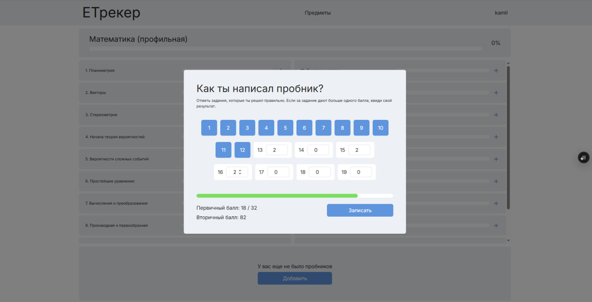

# 📊 EGE Tracker (ЕТрекер)

> Веб-приложение для аналитики, осознанного трекинга и объективной оценки уровня подготовки к ЕГЭ.

[](https://ege-tracker.vercel.app/)
*(⚠️ В деплое доступен только ЛЕНДИНГ, так как бэкенд-сервер временно не запущен)*.


---

## 🎯 Проблема и решение

**Проблема:** При подготовке к ЕГЭ школьники часто не понимают свой реальный уровень знаний, теряются в объеме материала и не знают, какие задания нужно повторить в первую очередь.

**Решение:** EGE Tracker помогает структурировать подготовку. Сервис позволяет фиксировать изученные темы и результаты вариантов (пробников), автоматически рассчитывая процент освоения каждого задания (например, «Планиметрия», «Стереометрия») и предмета в целом.

---

## 🖼 Интерфейс приложения

| Дашборд предметов | Прогресс по темам | Запись результатов пробника |
|:---:|:---:|:---:|
|  |  |  |

> 💡 **Крутая-фича:** При вводе результатов пробника система автоматически конвертирует **первичные баллы во вторичные** (тестовые) по шкалам ФИПИ (ЕГЭ 2026).

---

## ✨ Основной функционал

- 📈 **Динамическая статистика:** Автоматический перерасчет уровня владения предметом на основе результатов пробников.
- 🎯 **Детализация по кодификатору:** Прогресс-бары не только для предмета в целом, но и для каждой конкретной темы / номера задания.
- 📝 **Умный ввод пробников:** Удобное модальное окно с поддержкой заданий, за которые дается больше 1 балла.
- 📊 **Визуализация:** Интерактивные графики и чарты (Recharts).

---

## 🎨 Дизайн и UI/UX

Интерфейс приложения был полностью спроектирован с нуля в Figma перед началом разработки.

👉 [**Посмотреть макет проекта в Figma**](https://www.figma.com/design/cjr0KJisC2V6I7CyXgpoh6/Untitled?node-id=0-1&t=oXTq54weY7dtRRAG-1)

---

## 🛠 Технологический стек (Full-Stack Monorepo)

Архитектура проекта построена по принципу монорепозитория (Бэкенд и Фронтенд в одном репозитории).

### Frontend (`/frontend`)
- **Core:** React 19, Vite, TypeScript (в процессе миграции)
- **State Management:** Redux Toolkit (`@reduxjs/toolkit`, `react-redux`)
- **Routing:** React Router v7
- **UI & Charts:** Recharts, React Circular Progressbar
- **Styles:** SCSS (SASS) Modules (`.module.scss`)
- **Архитектура:** Модульная структура компонентов (выделение `layouts`, `pages`, и логических `sections` для сложных страниц).

### Backend (`/backend`)
- **Core:** Python, Django 6.0
- **API:** Django REST Framework (DRF)
- **Auth:** SimpleJWT (авторизация по Access/Refresh токенам)
- **Database:** PostgreSQL (`psycopg2-binary`) + `dj-database-url`
- **Deploy Utilities:** Gunicorn, Whitenoise (для раздачи статики)

---

## 🚀 Локальный запуск (Development)

Для запуска потребуется два терминала.

### 1. Запуск Backend (Терминал 1)
\```bash
cd backend
python -m venv venv
# Активация окружения (Windows: venv\Scripts\activate | macOS/Linux: source venv/bin/activate)
pip install -r requirements.txt
python manage.py migrate
python manage.py runserver
\```

### 2. Запуск Frontend (Терминал 2)
\```bash
cd frontend
npm install
npm run dev
\```
